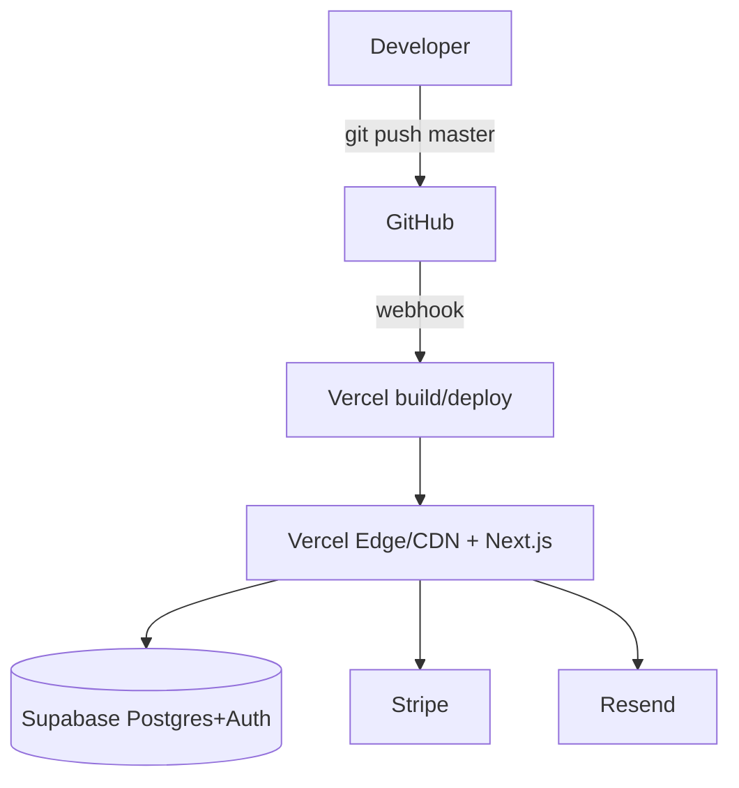
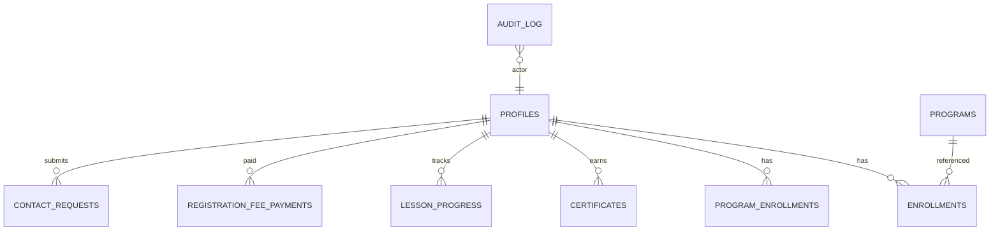
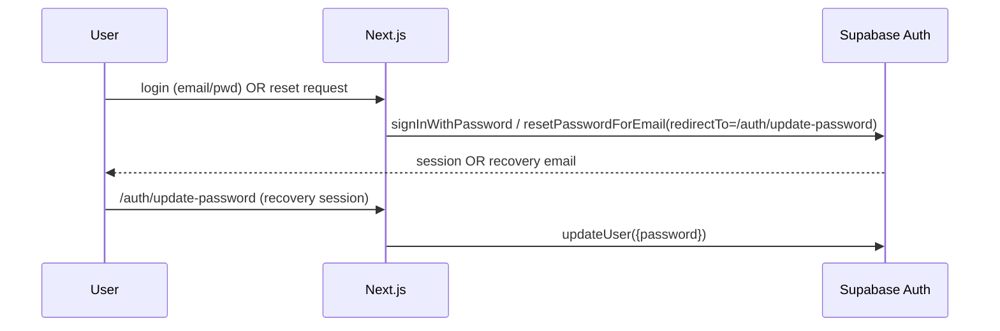
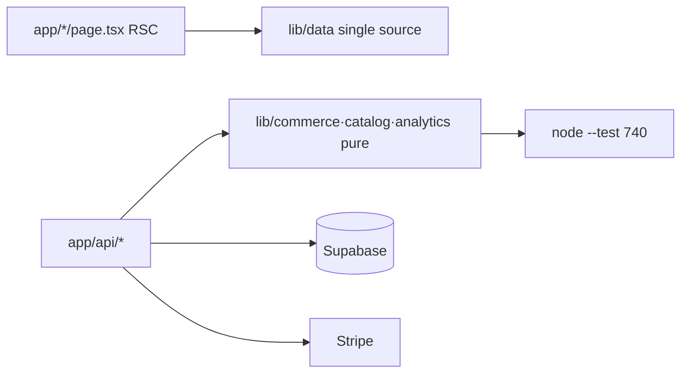

# ARCADINS — RESTORE GUIDE
**Rebuild the entire platform on a new Supabase project or a standard PostgreSQL server.**
Baseline: V2 code frozen at `6dfc922`. Includes architecture diagrams (§A) and validation (§B).

---

## Prerequisites (a fresh machine needs only)
- **Node.js 24.x** (see `package.json` engines) + **npm**
- **Git**
- **PostgreSQL client** (`psql`, `pg_dump`, `pg_restore`) — v15+
- A target DB: **a new Supabase project** OR **any PostgreSQL 15+ server**
- The **offline backup folder** produced by `backup/scripts/backup-all.sh` (+ auth/storage exports)
- The **secrets** (from your vault) for env variables

---

## Path 1 — Restore to a NEW SUPABASE project (fastest, like-for-like)
1. Create a new Supabase project. Note its ref/region/connection string.
2. Restore the database (authoritative full state):
   ```bash
   # Custom-format (recommended):
   pg_restore --no-owner --no-privileges --clean --if-exists \
     -d "postgresql://postgres.<ref>:<pwd>@<host>:5432/postgres" \
     backup/exports/<STAMP>/full_dump.dump
   # OR plain SQL:
   psql "postgresql://postgres.<ref>:...:5432/postgres" -f backup/exports/<STAMP>/full_dump.sql
   ```
3. Restore **auth** users if migrating accounts: apply `auth_schema.sql` (from the auth export), or
   re-invite users. Configure Auth: enable **Email** provider, set **Site URL** + **Redirect URLs**
   (must include `…/auth/update-password`), restore email templates + JWT settings.
4. Restore **Storage** buckets (if any) with the same names/policies; upload objects preserving hierarchy.
5. Restore **config**: extensions (`pgcrypto`), RLS (already in the dump), Vercel Cron + `CRON_SECRET`.

## Path 2 — Restore to a STANDARD PostgreSQL server (portable, provider-agnostic)
1. Provision PostgreSQL 15+ (self-hosted / RDS / Cloud SQL / Azure / DO).
2. Create extensions used: `create extension if not exists pgcrypto;` (the dump also declares them).
3. Restore schema+data from `full_dump.sql` / `full_dump.dump`.
4. **Replace Supabase‑specific pieces** (see PORTABILITY_REPORT.md):
   - `auth.*` schema → provide your own auth (e.g., Auth.js/Clerk) and a `users` table; map `auth.uid()`.
   - RLS policies referencing `auth.uid()` → adapt to your auth's current‑user function, or enforce
     authorization in the application layer.
   - Supabase client libs → replace with `pg`/Prisma/Drizzle + your auth SDK (app‑code change = a V3+ task).

## Rebuild the application (both paths)
```bash
git clone <repo> && cd arcadins-official
git checkout 6dfc922        # the frozen V2 baseline (or the desired tag)
npm install
cp .env.example .env.local  # fill with restored secrets + new DB/URLs
npm run typecheck && npm run lint && npm test && npm run build
npm run start               # or deploy to Vercel (connect the repo)
```

## Schema-from-zero (alternative, when you don't have a dump)
The repo migrations rebuild the parts they define, in order:
```
supabase/migrations/0000_staging_base.sql        (staging-only minimum: profiles, trigger, contact_requests)
0001 tutoring/tutor · 0002 roles · 0003 referrals · 0004 notifications · 0005 legacy_import
0006 migration_rpcs · 0007 hardening · 0008 program_reviews · 0009 academic_model
0011 academic_runtime_integration · 0012 catalog_products_pricing · 0013 audit_log · 0014 program_commerce
```
> ⚠️ **Important:** migrations do NOT recreate the original production business tables
> (`enrollments`, `programs`, `certificates`, `lesson_progress`) that were created directly in prod.
> For a faithful rebuild, **always prefer the `pg_dump` restore**; use migrations only for a clean-room
> re-derivation, and expect to re-create those tables from the dump's `schema_only.sql`.

---

## §A. Architecture diagrams

### A.1 Deployment


### A.2 Database (high-level groups)

*(Catalog tables — products/packages/offers/tenants from migration 0012 — exist in the migration but
are not applied to the current prod; program_enrollments/registration_fee_payments from 0014 ARE applied.)*

### A.3 Authentication


### A.4 Application


---

## §B. Validation (fresh-machine reproducibility)
A brand-new machine with only **Node + Git + PostgreSQL (or Supabase)** can recreate ARCADINS:
- [ ] `git clone` + `git checkout 6dfc922` → repo present.
- [ ] `npm install` → dependencies resolve.
- [ ] Restore DB from `full_dump.dump` (Path 1/2) → schema + data present.
- [ ] Fill `.env.local` from vault → app configured.
- [ ] `npm run typecheck && npm run lint && npm test && npm run build` → **all green (740 tests)**.
- [ ] `npm run start` → app boots; public routes render.
- [ ] Auth: login works; password reset email lands on `/auth/update-password` (redirect URL set).
- [ ] Smoke: key routes `200`, unknown `404`, `h1=1`/page, 0 console errors.
**If all boxes check, the platform is fully restored and portable.**
