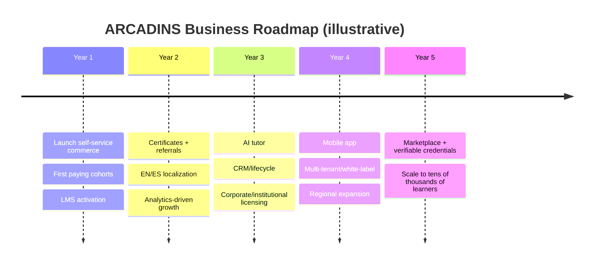

# ARCADINS TRAINING CENTER — BUSINESS MASTER PLAN
**Companion to the Master Project Dossier · 2026-08-04**

> **Integrity note:** ARCADINS is **pre‑launch / pre‑revenue** at the time of writing. This plan presents
> the business model and strategy honestly. **All financial figures below are clearly labeled ILLUSTRATIVE
> ASSUMPTIONS** for planning only — they are **not** actuals, forecasts of record, or guarantees, and must
> be validated with real market data and a first cohort.

---

## 1. Business Model
A **direct‑to‑consumer online education** business with two product lines:
- **Department A — Official Language Programs:** TEF/TCF Canada preparation (tutoring, simulations),
  sold as tiered packages.
- **Department B — Professional Trainings:** 9 career programs (24 weeks) with a completion certificate.

Delivery is **100% online, self‑paced with guided support**. The platform monetizes preparation and
training — **never** the official exam, a visa, or a guaranteed outcome.

## 2. Revenue Streams
| Stream | Description | Current pricing (owner‑set) |
|---|---|---|
| **TEF/TCF packages** | Starter/Essential/Premium/VIP, one‑time | $97 / $147 / $247 / $347 USD |
| **Professional trainings** | 9 programs, 24 weeks | 1,500 CAD + 100 CAD registration (one‑time global) |
| **Payment options (V3)** | 1×, 3×, 6× installments, or BNPL (Klarna/Affirm/Afterpay) | financing lifts conversion |
| **Future (V3+)** | Coaching add‑ons, corporate/institutional licenses, certificates, referrals | multi‑tenant seam ready |

## 3. Target Market
- **Primary:** French‑speaking (or French‑learning) prospective immigrants to **Canada/Québec** needing
  TEF/TCF results for Express Entry / PEQ / MIFI.
- **Secondary:** newcomers and professionals seeking Canadian‑context professional skills + French for work.
- **Geographies:** Canada diaspora, France, Haiti, Francophone Africa, Latin America, Middle East.
- *(Market sizing to be validated; not asserted here as fact.)*

## 4. Pricing Strategy
- **Value‑tiered** language packages (clear ✓/✗ feature matrix; VIP = intensive support + longer access).
- **Transparent** professional‑training pricing with **flexible financing** (1×/3×/6×/BNPL) to reduce the
  barrier of a CA$1,500 commitment.
- **Honest guarantees only:** 7‑day satisfaction/refund; **no result or visa guarantees**.
- **One authoritative price source** per product (no conflicting numbers).

## 5. Marketing Funnel
```mermaid
flowchart LR
  A[Awareness: SEO, content, social, referrals] --> B[Interest: TEF/TCF + formation pages]
  B --> C[Consideration: pricing, FAQ, guides, comparisons]
  C --> D[Intent: enrollment form / package selection]
  D --> E[Conversion: checkout + instant access (V3)]
  E --> F[Retention: dashboard, progress, certificates]
  F --> G[Advocacy: referrals, testimonials]
```

## 6. Sales Funnel
- **V2 (today):** Visitor → program page → **admission request (lead‑gen)** → advisor follow‑up.
- **V3 (target):** Visitor → program page → **self‑service checkout → instant enrollment → learning**.
  The V3 shift removes the 24–48h friction and scales without manual processing.

## 7. Lead Generation
- **Organic:** SEO on TEF/TCF/immigration topics, blog, guides, structured data.
- **Owned:** newsletter + free TEF/TCF guide (lead magnet), WhatsApp.
- **Paid (as budget allows):** search/social targeting immigration intent.
- **Referral/affiliate** (see §8).

## 8. Affiliate Strategy
Activate the existing referral module (V3): unique referral codes, honest disclosed affiliate
attribution, payout accounting, dashboards. Guardrails against self‑referral/fraud; CASL‑compliant
disclosure. Goal: lower CAC via trusted word‑of‑mouth in diaspora communities.

## 9. International Expansion
- **Phase 1:** solidify Canada‑bound Francophone market (FR‑primary).
- **Phase 2:** full EN/ES localization to widen reach (US, LatAm).
- **Phase 3:** institutional/government/corporate licensing (multi‑tenant seam already in the schema).
- Payment readiness already signals international intent (CAD/USD/EUR + mobile‑money ambition).

## 10. Risk Analysis
| Risk | Mitigation |
|---|---|
| Regulatory (immigration/education claims) | Strict honesty: no visa/result guarantees; clear disclaimers |
| Content completeness (LMS) | Phased content authoring; activate per‑program |
| Payment/BNPL risk | Merchant paid upfront on BNPL; installments = suspend‑on‑default |
| Competition (Coursera/Udemy/local) | Niche focus + honesty + immigration specialization |
| Key‑person / ops | Documentation package; managed infra; automation in V3 |
| Data/security | RLS, RBAC, headers, validation; backups + DR plan |
| Trust (new brand, no proof) | Build real testimonials from first cohorts; never fabricate |

## 11. Competitive Positioning
| | ARCADINS | Generalist MOOCs (Coursera/Udemy) | Local tutoring |
|---|---|---|---|
| Immigration/TEF‑TCF focus | **Strong** | weak | varies |
| Honesty/transparency | **Strong** | hype‑heavy | varies |
| Self‑service + automation | V3 target | strong | weak |
| Social proof (today) | weak (new) | strong | local |
| Price/financing flexibility | **Strong (V3)** | subscription | cash |
**Positioning statement:** *the honest, specialized, self‑service platform for succeeding at TEF/TCF and
building a Canadian career — without false promises.*

## 12. AI Strategy
- Runtime is **AI‑ready** (pure/composable; recommendations panel present).
- **V4:** AI tutor, study assistant, practice conversations, quiz generation, progress coaching — built on
  the latest Claude models, with guardrails, cost controls, and **honest "AI‑assisted" labeling** (never
  advertise AI features that aren't live — a V2 lesson learned when "AI proctoring" claims were removed).
- AI is a **differentiator and premium‑tier upsell**, sequenced after commerce + LMS are proven.

## 13. 5‑Year Roadmap (business)


### Illustrative unit economics (ASSUMPTIONS — validate before use)
> Example only, not a forecast. If average revenue per enrolled student ≈ CA$300–1,600 across product
> lines, with BNPL/installments improving conversion, then contribution depends on CAC and completion.
> **These placeholders must be replaced with measured data from the first cohort.** No traction is claimed.

---
*End of Business Master Plan. Figures are illustrative assumptions, not actuals.*
