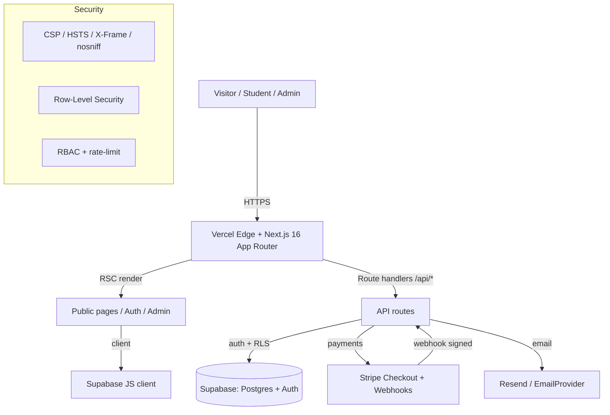

# ARCADINS TRAINING CENTER — MASTER PROJECT DOSSIER
**Permanent technical reference · V2 baseline frozen at `6dfc922` · 2026-08-04**

> Companion documents: `ARCADINS_V2_PRODUCTION_SNAPSHOT.md`, `ARCADINS_V3_MASTER_ROADMAP.md`,
> `ARCADINS_BUSINESS_MASTER_PLAN.md`, `ARCADINS_INVESTOR_BRIEF.md`,
> `ARCADINS_TECHNICAL_ONBOARDING_GUIDE.md`, `ARCADINS_FOUNDER_MANUAL.md`.

---

## 1. Executive Summary
ARCADINS Training Center is a French‑primary education platform for **French‑test preparation
(TEF/TCF Canada)** and **professional training**, aimed at newcomers, students, and professionals
targeting Canada. V2 is a production‑accepted, security‑hardened, accessibility‑ and SEO‑compliant
web platform built on Next.js 16 + Supabase + Stripe, deployed on Vercel. It ships a polished public
experience **and** a large body of built‑but‑dormant infrastructure (self‑service commerce, learning
runtime, certification, analytics) that V3 will activate. V2 contains **no fabricated statistics,
testimonials, or claims**; honesty is a first‑class product principle.

## 2. Project Vision
Become the **reference multilingual online education and French‑test‑preparation platform for
immigration to Canada** — trusted, honest, automated, and scalable to tens of thousands of learners.

## 3. Business Objectives
- Convert visitors into enrolled, paying students with a **self‑service, instant‑access** journey.
- Offer two clearly separated product lines without cross‑confusion (language vs professional).
- Maintain **trust through transparency** (no guarantees of results or visas).
- Build a maintainable, flag‑gated platform that scales from lead‑gen (V2) to full LMS (V3).

## 4. Mission
Give newcomers the **best possible preparation** (competency‑by‑competency, exam‑realistic) and a
clear, honest path — never selling outcomes that cannot be guaranteed.

## 5. Technical Architecture



| Layer | Technology | Notes |
|---|---|---|
| **Frontend** | Next.js 16.2.11 (App Router, RSC), React 19, TypeScript | Server components default; client components where interactive |
| **Backend** | Next.js route handlers (`/api/*`), pure domain libs (`src/lib/*`) | Logic decoupled from I/O via adapters |
| **Database** | Supabase PostgreSQL, 14 migrations (`0000`–`0014`) | RLS on user‑owned tables |
| **Authentication** | Supabase Auth (email/password + recovery) | Anti‑open‑redirect on login |
| **Storage** | Supabase (data), Vercel (static assets/build) | Media/PDF resources handled per‑lesson (V3 activation) |
| **Analytics** | Built engine (`src/lib/analytics`) + `/admin/analytics` | Product analytics (GA4/Plausible) = V3 |
| **Deployment** | Vercel (Git‑integration, auto‑deploy on `master`) | Immutable per‑commit deployments |
| **Infrastructure** | Vercel + Supabase (managed) | No self‑managed servers |
| **Security** | CSP, HSTS‑preload, X‑Frame DENY, nosniff, Permissions‑Policy, RLS, RBAC, rate‑limit, Zod | See §9 |
| **Languages** | 7‑language i18n (fr/en/es/it/pt/de/ht); FR‑primary | Switcher flag‑gated at launch |
| **SEO** | Titles, descriptions, canonical, OG, Twitter, JSON‑LD, sitemap, robots | Canonical→domain at cutover |
| **Performance** | Server Components, dynamic imports, code‑split home | CWV measurement = pre‑scale task |
| **Accessibility** | 1 `<h1>`/page, alts, labels, WCAG‑AA contrast, native `<details>` | Verified live |

## 6. Repository Structure
```
src/
  app/                    # Next.js App Router (pages, layouts, /api routes)
    (public pages)        # /, /tef, /tcf, /tutorat, /formations, /tarifs, /examens, /immigration, ...
    auth/                 # login, register, reset-password, update-password
    inscription/          # enrollment funnel (forfaits, formation, succes, annulation) — flag-gated
    admin/                # admin console (health, migration, contacts, reviews, analytics, commerce)
    api/                  # route handlers (checkout, webhook, contact, learn/*, inscription/*)
  components/             # UI (home/*, layout/*, learn/* [V3 runtime UI], ui/*)
  lib/
    data/                 # single-source-of-truth data (programs, tef-program, tcf-program, plans, ...)
    commerce/             # program/formation commerce engines (flag-gated) + tests
    catalog/              # generic product/offer/entitlement domain
    analytics/            # learning-analytics engine + tests
    runtime/              # V3 learning runtime (~298 files, dormant): assessment, certification, ...
    i18n.ts               # 7-language translation table
    config/               # launch flags, experience flags
    supabase/, rbac.ts, rate-limit.ts, audit/, notifications/
supabase/migrations/      # 0000–0014 (versioned schema)
docs/                     # this dossier + snapshots + roadmaps
```

## 7. Completed Features (V2) — by domain
| Domain | Delivered |
|---|---|
| **Public website** | Homepage (hero, 2‑department split, stats, why/how, video, services), all transverse pages |
| **Training catalog** | 9 professional formations with deepened content (objectives, audience, careers, prerequisites, per‑module descriptions) |
| **TEF/TCF** | Full `/tef` + `/tcf` program pages, shared `/tutorat` (4 competencies × 4 levels), Course JSON‑LD |
| **Authentication** | Register, login (sanitized redirect) |
| **Password Recovery** | `/auth/reset-password` + `/auth/update-password` + login link (Supabase) |
| **Admin** | Health, migration validator, contacts, reviews, tutoring/tutor queues, analytics, commerce |
| **Analytics** | Pure analytics engine + admin dashboard (revenue, enrollments, completion, top programs) |
| **Content Management** | Single‑source data files; honest empty states; no fabricated content |
| **Internationalization** | 7‑language table; FR‑primary; routed locales (fr/en/es) |
| **Security** | Headers, RLS, RBAC, rate‑limit, Zod validation, signed webhooks |
| **SEO** | Metadata, canonical, OG/Twitter, JSON‑LD, sitemap, robots |
| **Accessibility** | 1 h1/page, alts, labels, contrast tokens, keyboard‑friendly components |
| **Built‑but‑dormant** | Self‑service commerce (+BNPL), learning runtime, certification, migration 0014 |

## 8. Production Infrastructure
| Item | Current state |
|---|---|
| **Live URL** | `https://arcadins-official.vercel.app` |
| **Official domain** | `www.arcadins-training.com` → **legacy V1 on Render** (cutover to V2 pending) |
| **DNS** | Managed at registrar; V2 cutover = point domain to Vercel + add domain in Vercel |
| **Hosting** | Vercel (frontend + API); Supabase (DB/Auth) |
| **Environment variables** | See Snapshot §5 (Stripe, Supabase, Resend, site URL, cron secret) |
| **CI/CD** | Vercel Git‑integration: push `master` → build → deploy |
| **Git** | GitHub `jehopakingconsulting-alt/arcadins-official`, branch `master` |
| **Versioning** | Semantic tags (`v1.x`, `v2.0.0-production`; recommend `v2.1.0` for accepted gold) |
| **Backups** | Supabase Free = no auto‑backups → `pg_dump` before writes (upgrade to Pro for daily+PITR) |
| **Monitoring** | Vercel logs/analytics; `/admin/health`; `/admin/analytics` |

## 9. Security Architecture
- **Authentication:** Supabase Auth; passwords never stored by the app; recovery via signed email links.
- **Authorization:** RBAC (`src/lib/rbac.ts`); admin routes verify role then `redirect`.
- **Password recovery:** request → email → `update-password` (recovery session verified).
- **Headers:** CSP, HSTS (2‑yr preload), X‑Frame DENY, nosniff, Referrer‑Policy, Permissions‑Policy.
- **Rate limiting:** `src/lib/rate-limit.ts`.
- **Data validation:** Zod on all public submissions; server‑authoritative pricing (never trust browser).
- **Webhooks:** Stripe signature verification + idempotency ledger.
- **RLS:** self‑read policies on user‑owned tables; service‑role only server‑side.

## 10. Deployment Guide (step‑by‑step)
1. Ensure gates green locally: `npm run typecheck && npm run lint && npm test && npm run build`.
2. Commit to `master` with a descriptive message (Co‑Authored‑By footer).
3. `git push origin master` → Vercel auto‑builds and deploys.
4. Wait ~1–2 min; confirm the new deployment in Vercel.
5. **Post‑deploy smoke:** key routes `200`, unknown route `404`, `h1=1` per page, 0 console errors,
   no legacy claims on `/tarifs`.
6. Tag the release (`git tag -a vX.Y.Z -m "…" && git push --tags`).
7. For DB changes: backup → apply migration in Supabase SQL Editor (transactional) → verify.

## 11. Disaster Recovery Plan
See Snapshot §8. Key: Vercel instant rollback (promote last‑good deployment); DB restore from
`pg_dump`/PITR; secret rotation on leak; V1/Render as domain fallback until cutover. Targets:
**RTO ≤ 1h, RPO ≤ 24h** (with Pro backups).

## 12. Maintenance Procedures
- Never merge to `master` unless all gates are green.
- Content changes only via single‑source data files (no duplicated values).
- Additive/idempotent/reversible migrations; staging + backup + authorization before prod writes.
- Keep unreleased subsystems flag‑gated OFF until fully tested.
- Periodic `npm audit`; keep dependencies patched.

## 13. Operational Procedures
- Lead intake: `/contact` → `contact_requests` → `/admin/contacts`.
- Admin access via `profiles.role = 'admin'`.
- Email = best‑effort (failure never blocks a paid enrollment); failures logged.
- Cron: `/api/cron/expire-pending` (guarded by `CRON_SECRET`).

## 14. Repository Rules
- `master` is protected‑by‑discipline; every commit is deployable.
- No dead code, no `console.log`/`debugger`/`TODO` in app code (ESLint‑enforced).
- One authoritative source per public number/price/label.
- Documentation lives in `docs/`.

## 15. Coding Standards
- TypeScript strict; pure/composable domain logic + adapters; low coupling, high cohesion.
- Node‑test files: relative `.ts` imports, no TS parameter properties, `--experimental-strip-types`.
- Match surrounding code style; French‑primary user‑facing copy at launch.
- Server‑authoritative pricing/entitlements; never trust client input.

## 16. Branch Strategy
- Trunk‑based on `master` (small, verified increments).
- Feature flags instead of long‑lived branches for unreleased subsystems.
- (V3 recommendation) short‑lived feature branches + PR review as the team grows.

## 17. Release Strategy
- Semantic versioning; annotated tags per release.
- Gate: typecheck + lint + tests + build green → push → smoke test → tag.
- Rollback = promote previous Vercel deployment or `git revert`.

## 18. Testing Strategy
- **Unit/domain:** `node --test` (740 tests green) over pure logic (commerce, analytics, runtime, validation).
- **Static:** `tsc --noEmit`, ESLint (full `src`).
- **Build:** `next build` as an integration gate.
- **Live/E2E (V3):** 30‑scenario Stripe test‑mode journey before commerce activation; Lighthouse for CWV.

## 19. Future Scaling Strategy
- Managed infra (Vercel + Supabase) scales horizontally; add read replicas / Pro tier as load grows.
- Multi‑tenant seam already present (migration `0012` `tenants` + `current_tenant()`), enabling
  white‑label/enterprise without re‑architecture.
- Move CSP to nonce‑based; add CDN caching for static content; measure and optimize CWV.

## 20. Known Future Improvements
- **V3:** activate self‑service commerce + payments (incl. BNPL), student dashboard, LMS runtime,
  certificates, promotions/referral, analytics dashboards, domain cutover, full EN/ES localization.
- **V4:** AI tutor/assistant/recommendations, native mobile app, CRM + lifecycle automation at scale.
- **V5:** multi‑tenant/white‑label for institutions/governments; marketplace of programs; credential
  interoperability (verifiable credentials); data/BI platform.

---
*End of Master Project Dossier. V2 code baseline is frozen.*
