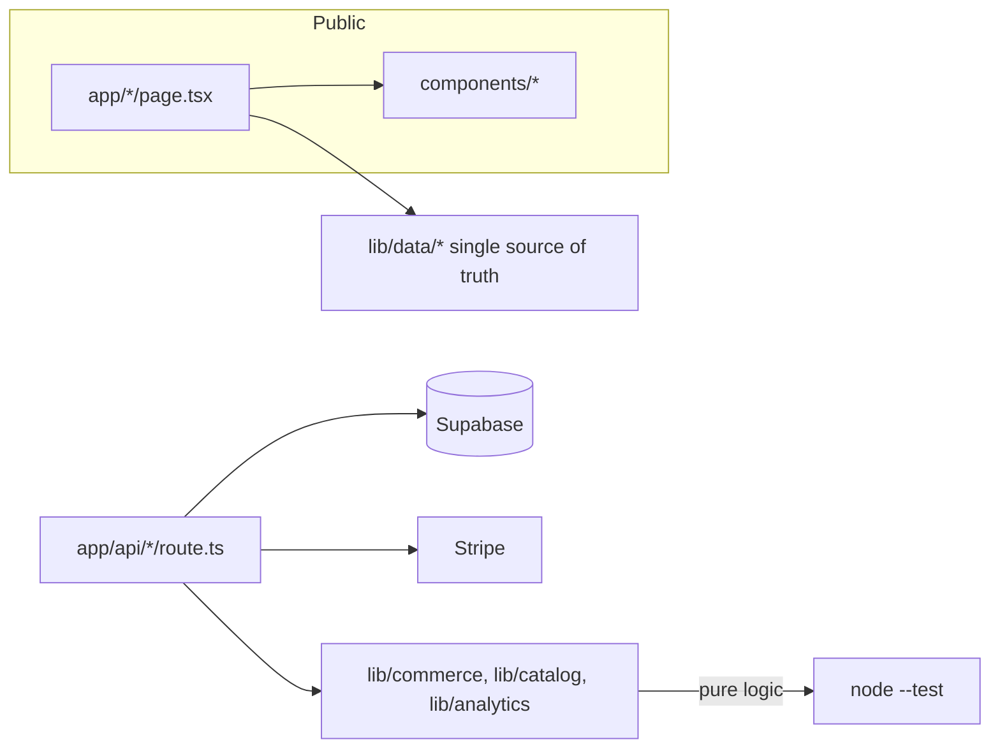

# ARCADINS — TECHNICAL ONBOARDING GUIDE
**Goal: a new senior developer is productive in under one day.** · V2 baseline `6dfc922`

---

## 0. TL;DR (read this first)
- Stack: **Next.js 16 (App Router, RSC) · React 19 · TypeScript · Tailwind v4 · Supabase · Stripe · Vercel**.
- Repo: `github.com/jehopakingconsulting-alt/arcadins-official`, branch `master` (trunk‑based).
- **Golden rule:** never merge to `master` unless `typecheck + lint + test + build` are all green.
- Unreleased subsystems (commerce, LMS) are **flag‑gated OFF**. Don't "turn them on" without the activation plan.
- Honesty rule: **no fabricated stats/testimonials/claims; one authoritative source per public number.**

## 1. Local setup
```bash
git clone <repo> && cd arcadins-official
npm install
cp .env.example .env.local   # fill Supabase/Stripe/Resend keys (ask the owner; never commit)
npm run dev                  # http://localhost:3000
```
**Gates (run before every push):**
```bash
npm run typecheck   # tsc --noEmit
npm run lint        # eslint
npm test            # node --test (740 tests)
npm run build       # next build
```

## 2. Mental model

- **Pure domain logic** lives in `src/lib/*` and is unit‑tested with `node --test`. Keep it I/O‑free;
  do persistence in route handlers/adapters.
- **Pages** are Server Components by default; add `"use client"` only when interactive.
- **Data** (prices, programs, copy) lives in `src/lib/data/*` and `src/lib/i18n.ts` — never hardcode duplicates.

## 3. Where things are
| I want to… | Go to |
|---|---|
| Edit a program page | `src/app/tef|tcf/page.tsx`, data in `src/lib/data/tef-program.ts` / `tcf-program.ts` |
| Edit a formation | `src/lib/data/programs.ts` + `src/lib/data/formation-details.ts` |
| Edit pricing | `src/lib/data/program-plans.ts` (TEF/TCF); formations price in `programs.ts` |
| Edit copy/translations | `src/lib/i18n.ts` (7 languages) |
| Touch commerce | `src/lib/commerce/*` (+ tests) — **flag‑gated** |
| Touch the LMS | `src/lib/runtime/*` + `src/components/learn/*` — **dormant** |
| Add/inspect a flag | `src/lib/config/launch-flags.ts`, `experience-flags.ts` |
| DB schema | `supabase/migrations/*` (0000–0014) |
| Admin console | `src/app/admin/*` |

## 4. Conventions that matter
- **Node‑test files:** relative `.ts` imports; **no TypeScript parameter properties**; runs under
  `--experimental-strip-types`.
- **Server‑authoritative pricing/entitlements:** never trust client‑sent prices; browser sends identifiers only.
- **Feature flags:** unreleased = OFF; flipping requires the documented activation + verification.
- **French‑primary** user‑facing copy at launch; add i18n keys for all 7 languages when adding UI text.
- **No dead code:** ESLint blocks unused imports; no `console.log`/`debugger`/`TODO` in app code.

## 5. Common tasks (recipes)
- **Add a public page:** `src/app/<route>/page.tsx` (+ `layout.tsx` for metadata) → ensure **one `<h1>`** →
  add to `sitemap.ts` if indexable → gates → push.
- **Add a formation:** add to `PROGRAMS` (`programs.ts`) + detail in `formation-details.ts` (+ i18n).
- **Change a price:** edit the single source (`program-plans.ts` / `programs.ts`) — check nothing else
  duplicates the number.
- **DB change:** write an additive/idempotent/transactional migration → staging → backup → apply in
  Supabase SQL Editor with explicit authorization → verify.

## 6. Deploy
`git push origin master` → Vercel auto‑deploys → run post‑deploy smoke (routes 200, 404 ok, h1=1,
0 console errors). Tag releases.

## 7. Gotchas (learned in V2)
- **PowerShell** doesn't accept `&&`; use `;` (or just run commands separately).
- Supabase **Free plan has no auto‑backups** → `pg_dump` before prod writes.
- Two enrollment surfaces exist (`enrollments` System‑1 + `program_enrollments`) — intentional during the
  lead‑gen→commerce transition; unify in V3.
- Never advertise a capability that isn't live (e.g., "AI proctoring" was removed for this reason).

## 8. Who to ask / references
- Product/architecture: `docs/ARCADINS_MASTER_PROJECT_DOSSIER.md`.
- What to build next: `docs/ARCADINS_V3_MASTER_ROADMAP.md`.
- Release state: `docs/ARCADINS_V2_PRODUCTION_SNAPSHOT.md`.

---
*You should now be able to run, navigate, change, test, and deploy safely. Welcome aboard.*
