# ARCADINS Training Center — Sprint 2: Enterprise Database Architecture (DESIGN ONLY)

> **No SQL migrations written. Production and staging untouched.** This is the architecture-first
> deliverable for approval. It is grounded in the **exact current schema** (migrations `0000–0013`,
> ~45 live/prepared tables), and designs the enterprise target as a **reconciliation + gap-fill**, never a
> rebuild (no duplicated tables/relationships). Approve this, then I write migrations `0014+` (staging-first).

---

## 0. Method & guiding principle
The database is **already ~80% of the enterprise target**. The academic model, runtime, commerce/catalog,
tenancy seam, referrals, notifications, reviews, and audit log all exist. Sprint 2's job is therefore:
**(A)** make the schema **self-contained & drift-free** so a fresh staging project builds from zero, and
**(B)** add the **7 genuinely missing entities**. Everything additive, idempotent, reversible.

---

## 1. Required-entity coverage (the gap map)

| Required entity | Status | Backing table(s) |
|---|---|---|
| Students / Instructors / Tutors / Administrators / Super Admin | ⚠️ **EXTEND** | `profiles.role` (text+CHECK). CHECK currently allows student/admin/tutor/content_manager/finance_manager/support — **missing `instructor` and `superadmin`**. |
| Courses | ✅ EXISTS | `programs` + `products` + `program_versions` |
| **Departments** | ❌ **NEW** | none — the two-department IA is frontend-only today |
| **Categories** | ❌ **NEW** | none — no taxonomy table |
| Modules / Lessons | ✅ EXISTS | `modules`, `lessons` |
| Quizzes / Exams | ✅ EXISTS | `assessments`, `assessment_questions`, `assessment_attempts`, `assessment_sessions`, `exam_runtime_sessions` |
| Certificates | ✅ EXISTS | `certificates` (base) + `certificate_status_history` + `credential_integrity_records` + `public_verification_events` |
| **Orders** | ❌ **NEW** | none — only post-purchase `enrollments`; no order/checkout record |
| **Payments** | ❌ **NEW** | none native — only `offers.stripe_price_id` + `legacy_payments` (import). No charge/refund ledger. |
| Enrollments | ✅ EXISTS (⚠️ drift) | `enrollments` (0012 canonical) + `licenses`/`license_seats` (B2B) |
| Progress | ✅ EXISTS | `module_progress`, `lesson_progress`, `progress_projection`, `runtime_snapshots` |
| Reviews | ✅ EXISTS | `program_reviews` |
| Referral System | ✅ EXISTS | `referral_codes`, `referral_relationships`, `referral_commissions` |
| Notifications | ✅ EXISTS | `notifications`, `notification_preferences`, `notification_delivery_logs` |
| **Files** | ❌ **NEW** | none — assets only as jsonb in `lessons.resources`; no storage-object registry |
| **Videos** | ❌ **NEW** | none — only jsonb blocks in `lessons.content` |
| **Student Notes** | ❌ **NEW** | only `runtime_events(type='note')` — not queryable |
| **Bookmarks** | ❌ **NEW** | only `runtime_events(type='favori')` — not queryable |
| **Discussion** | ❌ **NEW** | none — no forum/threads/posts |
| Audit Logs | ✅ EXISTS | `audit_log` (0013) + `academic_audit_events` + `certificate_status_history` |
| Analytics | ⚠️ PARTIAL | raw events (`learning_events`, `runtime_events`, `academic_audit_events`); no aggregated marts (deferred — build on demand) |

**Net new tables to design (7 domains):** `departments`, `categories` (+`product_categories`), `orders`
(+`order_items`), `payments` (+`refunds`), `assets` (+`lesson_assets`), `notes`, `bookmarks`,
`discussion_threads` (+`discussion_posts`). Plus **2 reconciliation fixes** (role CHECK; enrollments drift).

---

## 2. Complete ER Diagram (enterprise core)

> Legacy import tables (`legacy_*`) and low-level runtime-session tables are omitted from the diagram for
> legibility (they are catalogued in §3); they are import/staging and server-private, not part of the
> commercial/learning core. `NEW` = to be created this sprint.

```mermaid
erDiagram
  auth_users ||--|| profiles : "1:1"
  auth_users ||--o{ enrollments : "enrolls"
  auth_users ||--o{ orders : "places"
  auth_users ||--o{ assessment_attempts : "attempts"
  auth_users ||--o{ submissions : "submits"
  auth_users ||--o{ module_progress : "progresses"
  auth_users ||--o{ notes : "writes"
  auth_users ||--o{ bookmarks : "saves"
  auth_users ||--o{ discussion_posts : "authors"
  auth_users ||--o{ program_reviews : "reviews"

  tenants ||--o{ programs : "owns"
  tenants ||--o{ products : "owns"

  departments ||--o{ products : "groups (NEW)"
  categories ||--o{ product_categories : "tags (NEW)"
  products ||--o{ product_categories : "tagged (NEW)"

  programs ||--o{ program_versions : "versions"
  programs ||--o{ products : "commercialized as"
  program_versions ||--o{ modules : "contains"
  modules ||--o{ lessons : "contains"
  program_versions ||--o{ assessments : "defines"
  assessments ||--o{ assessment_questions : "has"
  assessments ||--o{ assessment_attempts : "attempted via"
  program_versions ||--o{ assignments : "defines"
  assignments ||--o{ submissions : "receives"
  lessons ||--o{ lesson_assets : "uses (NEW)"
  assets ||--o{ lesson_assets : "referenced by (NEW)"

  products ||--o{ packages : "sold as"
  packages ||--o{ offers : "priced by"
  packages ||--o{ bundle_items : "bundles"
  offers ||--o{ order_items : "purchased in (NEW)"
  orders ||--o{ order_items : "contains (NEW)"
  orders ||--o{ payments : "paid by (NEW)"
  payments ||--o{ refunds : "refunded by (NEW)"
  orders ||--o{ enrollments : "provisions"

  discounts ||--o{ coupons : "issued as"
  coupons ||--o{ coupon_redemptions : "redeemed"
  organizations ||--o{ licenses : "buys"
  licenses ||--o{ license_seats : "assigns"
  scholarships }o--|| organizations : "granted by"

  programs ||--o{ enrollments : "entitles"
  program_versions ||--o{ module_progress : "tracked in"
  certificates }o--|| program_versions : "certifies"

  program_versions ||--o{ discussion_threads : "hosts (NEW)"
  discussion_threads ||--o{ discussion_posts : "contains (NEW)"

  auth_users ||--o{ referral_codes : "owns"
  auth_users ||--o{ notifications : "receives"
  auth_users ||--o{ audit_log : "acts (actor)"
```

---

## 3. Table list (by domain — EXISTING / EXTEND / NEW)

**Identity & access** — `profiles`⚠️EXTEND(role CHECK), `contact_requests`.
**Tenancy** — `tenants` (⚠️ enable RLS), `countries`.
**Catalog / commerce** — `programs`, `products`, `packages`, `bundle_items`, `offers`, `discounts`,
`coupons`, `coupon_redemptions`, `scholarships`, `organizations`, `licenses`, `license_seats`,
`enrollments`⚠️drift · **NEW:** `departments`, `categories`, `product_categories`, `orders`, `order_items`,
`payments`, `refunds`.
**Academic content** — `program_versions`, `modules`, `lessons`, `assessments`, `assessment_questions`,
`rubrics`, `assignments`, `cohorts`, `content_translations` · **NEW:** `assets`, `lesson_assets`.
**Learning runtime & progress** — `assessment_attempts`, `submissions`, `module_progress`,
`lesson_progress`, `progress_projection`, `runtime_snapshots`, `runtime_events`, `assessment_sessions`,
`exam_runtime_sessions`, `learning_events`, `tutor_assignments`, `academic_commands`,
`academic_command_results`.
**Credentials** — `certificates`(base), `certificate_status_history`, `credential_integrity_records`,
`public_verification_events`.
**Engagement** — `program_reviews` · **NEW:** `notes`, `bookmarks`, `discussion_threads`, `discussion_posts`.
**Growth** — `referral_codes`, `referral_relationships`, `referral_commissions`.
**Messaging** — `notifications`, `notification_preferences`, `notification_delivery_logs`.
**Audit** — `audit_log`, `academic_audit_events`, `application_status_history`.
**Legacy import (frozen)** — `legacy_learners`, `legacy_tests`, `legacy_modules`, `legacy_certificates`,
`legacy_payments`, `legacy_prospects`, `legacy_referrals`, `legacy_admin_settings`, `legacy_audit_log`,
`legacy_id_map`.

---

## 4. New tables — proposed shape (design, not SQL)

- **departments** — `id uuid pk`, `slug unique`, `name`, `kind CHECK(official_language_programs|professional_trainings)`, `sort`, `tenant_id→tenants`. Products link via `products.department_id`. *(Makes the two-department IA a first-class entity instead of frontend-only.)*
- **categories** — `id`, `slug unique`, `name`, `parent_id→categories` (self-nesting), `tenant_id`. **product_categories** (`product_id`,`category_id`) PK pair.
- **orders** — `id`, `user_id→auth.users`, `status CHECK(pending|paid|failed|refunded|cancelled)`, `currency`, `subtotal_cents`, `discount_cents`, `tax_cents`, `total_cents`, `coupon_code`, `stripe_checkout_session_id`, `tenant_id`, timestamps. **order_items** — `order_id→orders`, `offer_id→offers`, `qty`, `unit_amount_cents`, `entitlement_snapshot jsonb`.
- **payments** — `id`, `order_id→orders`, `provider CHECK(stripe)`, `stripe_payment_intent_id unique`, `amount_cents`, `currency`, `status CHECK(requires_action|succeeded|failed)`, `raw jsonb`, `occurred_at`. **refunds** — `id`, `payment_id→payments`, `amount_cents`, `reason`, `stripe_refund_id unique`, `status`, `occurred_at`. *(Native money ledger reconciling Stripe webhooks; distinct from `legacy_payments`.)*
- **assets** — `id`, `tenant_id`, `kind CHECK(video|pdf|image|audio|archive)`, `storage_bucket`, `storage_path`, `mime`, `bytes`, `duration_sec`, `checksum`, `title`, `created_by`. **lesson_assets** — (`lesson_id→lessons`,`asset_id→assets`,`role CHECK(video|download|image)`,`position`). *(Replaces loose jsonb file refs with a queryable registry + storage policies.)*
- **notes** — `id`, `user_id→auth.users`, `lesson_id→lessons`, `body`, `updated_at`. UNIQUE(user_id, lesson_id) or many-per-lesson (design choice → recommend many, with `anchor jsonb`).
- **bookmarks** — `id`, `user_id`, `entity_type CHECK(lesson|module|program)`, `entity_id`, `created_at`. UNIQUE(user_id, entity_type, entity_id).
- **discussion_threads** — `id`, `scope CHECK(program|module|lesson|cohort)`, `scope_id`, `program_version_id→program_versions`, `title`, `created_by`, `status CHECK(open|locked|hidden)`. **discussion_posts** — `id`, `thread_id→discussion_threads`, `parent_post_id→discussion_posts` (nesting), `author_id→auth.users`, `body`, `status CHECK(visible|hidden|deleted)`, timestamps.

---

## 5. Indexes (strategy)
Follow the existing convention `<table>_<cols>_idx`. Every FK gets a supporting index; every
`status`/lifecycle column used in filters is indexed; time-series tables index `(<owner>, created_at desc)`.
New: `orders(user_id,status)`, `order_items(order_id)`, `payments(order_id)`, `payments(stripe_payment_intent_id)` UNIQUE,
`product_categories(category_id)`, `products(department_id)`, `notes(user_id,lesson_id)`,
`bookmarks(user_id,entity_type,entity_id)` UNIQUE, `discussion_posts(thread_id,created_at)`.

## 6. Foreign keys (policy)
All FKs `ON DELETE CASCADE` for owned children, `SET NULL` for optional references (matching existing
style). **Fix the two logical (non-FK) references** where safe: `referral_commissions.enrollment_id`→
`enrollments(id)`. **Leave runtime `learner_id`/`owner_learner_id` intentionally FK-free** (0011 decouples
runtime from content by design) but **document** them as logical references to `auth.users`.

## 7. Constraints (policy)
Keep the established convention: **`text` + `CHECK IN(...)`** for all enumerations (no native ENUM — matches
the whole codebase and avoids migration pain when values evolve). Money as **integer cents + `currency text`**.
`UNIQUE` on natural keys (slugs, `(user_id, product_id)`, `(user_id, lesson_id)`…). Timestamps `timestamptz`
default `now()`.

## 8. RLS strategy (unified)
Codify the pattern already used, via **helper functions** (new, additive):
- `public.is_admin()` / `public.is_staff()` — role check against `profiles.role` (replaces the repeated inline
  `EXISTS(select 1 from profiles…)` subqueries; one source of truth).
- `public.current_tenant()` — **already exists**.

Policy families (as already applied):
- **Owner-scoped:** `user_id = auth.uid()` (enrollments, notes, bookmarks, attempts, orders self-read).
- **Public-read:** `status IN (published|active|approved)` (catalog, published content, approved reviews).
- **Staff/admin-read:** `is_admin()`/`is_staff()` (queues, audit, orders, payments).
- **Service-role-only writes** (RLS on, no client write policy) for sensitive tables (assessments/questions,
  attempts grading, orders/payments/refunds, certificates issuance, audit_log — already the norm).
- **Discussion:** authenticated read within enrolled scope; author-write; staff-moderate.
- **Tenancy (activate later):** append `AND tenant_id = public.current_tenant()` to public-read policies +
  **enable RLS on `tenants`** when white-label goes live (currently mono-tenant → root default).

## 9. Naming convention (codified from the existing schema)
snake_case plural tables; `id uuid pk default gen_random_uuid()`; FK cols `<entity>_id`; join tables
composite PK; `created_at`/`updated_at timestamptz default now()`; enums = `text` + `CHECK IN(...)`; money =
`_cents int` + `currency text`; indexes `<table>_<cols>_idx`; RLS policies `<table>_<audience>_<action>`
(e.g. `orders_self_read`, `payments_admin_read`, `products_public_read`).

## 10. Migration plan (additive · idempotent · reversible · staging-first)
Written **only after approval**, one gated file at a time, applied to **staging** via SQL Editor, verified,
before any prod consideration.

| Mig | Title | Content |
|---|---|---|
| **0014** | Base reconciliation | Make the set self-contained for a **fresh** project: `create table if not exists` the base `certificates`, `enrollments`, `lesson_progress` (canonical superset); **fix enrollments drift** via `alter table … add column if not exists` for all 0012 columns (works even where the table pre-exists). |
| **0015** | Roles & RLS helpers | Extend `profiles.role` CHECK to add `instructor`, `superadmin`; add `is_admin()`/`is_staff()`; refactor policies to use them (no behavior change). |
| **0016** | Taxonomy | `departments`, `categories`, `product_categories`; `products.department_id`. |
| **0017** | Commerce ledger | `orders`, `order_items`, `payments`, `refunds` (+ RLS + indexes). |
| **0018** | Content assets | `assets`, `lesson_assets` (+ storage buckets `course-media`, `certificates`, `avatars` + policies). |
| **0019** | Engagement | `notes`, `bookmarks`, `discussion_threads`, `discussion_posts`. |
| **0020** | (deferred) Analytics marts | Only if raw events prove insufficient. |

Each migration ships with a documented **down** (drop new objects / revert CHECK) and is idempotent.

## 11. Risk analysis
| # | Risk | Severity | Mitigation |
|---|---|---|---|
| R1 | **enrollments drift** — 0012 `create table if not exists` won't add its rich columns where a base `enrollments` already exists (prod). | 🔴 High | 0014 uses `alter … add column if not exists` for every 0012 column; reconcile to one canonical shape. |
| R2 | **Non-self-contained base** — `certificates`/`enrollments`/`lesson_progress` base DDL is **not in the repo** (exists only in prod's original setup); a fresh staging apply of 0009 would fail. | 🔴 High | 0014 creates these bases idempotently so staging builds from zero. |
| R3 | **Role CHECK missing `instructor`/`superadmin`** — Sprint 7 dashboards need them. | 🟠 Med | 0015 widens the CHECK (keep default `student`). |
| R4 | **Tenancy RLS inactive** + RLS not enabled on `tenants`. | 🟠 Med | Keep mono-tenant now; ship the tenant-scoped policy template + enable-RLS as a gated step before white-label. |
| R5 | **Dual learner identifiers** (`user_id` FK vs `owner_learner_id` no-FK). | 🟡 Low | Document as intentional runtime decoupling; don't force FKs on 0011. |
| R6 | **Prod has real users/data** (294 rows, Free plan/no PITR). | 🔴 High | **Staging-first**; prod only later under backup-proof + per-step gates. |
| R7 | Payments/orders introduce a money ledger that must reconcile with Stripe webhooks exactly. | 🟠 Med | `stripe_payment_intent_id`/`stripe_refund_id` UNIQUE for idempotent webhook upserts (Sprint 4 wiring). |

---

## Decision requested
Approve this architecture (or request changes). On approval I will write migrations **`0014`** first
(base reconciliation — the safest, highest-value step), apply it to **staging only**, verify, and report —
before proceeding. **No SQL and no DB changes until you approve.**
